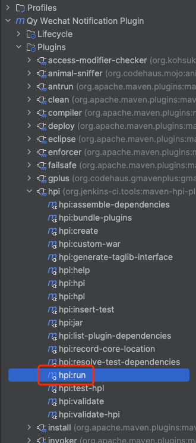

# 企业微信Jenkins构建通知插件


## 介绍

> 在 https://github.com/zengsl/jenkins-plugin-qy-wechat-notification-plus升级插件版本

源项目地址：https://github.com/jenkinsci/qy-wechat-notification-plugin

在原插件基础上对Build完成消息支持moreInfo、构建人、项目描述信息打印，以满足业务需求


JDK 1.8

## 使用方法

### 默认打印内容

任务描述、构建人员、构建用时

任务描述：如果设置了就会打印


### moreinfo

内容会拼接在默认打印内容下方


## 测试

> 通过远程调试设置可以设置断点

启动jenkins,访问http://localhost:8080




### 本地调试

- IDEA通过maven插件debug启动hpi:run

- 在代码中直接打断点

### 远程调试

```shell
export MAVEN_OPTS="-agentlib:jdwp=transport=dt_socket,server=y,suspend=n,address=5005"

mvn hpi:run -Djetty.port=8090
```

## TODO

- [ ] 提供更方便的方式来打印“预构建消息”