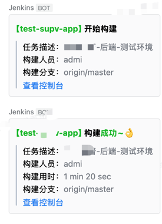
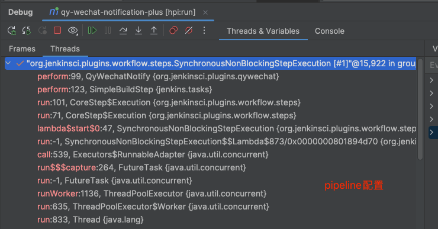
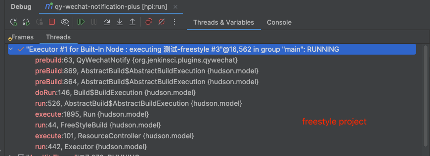

# 企业微信Jenkins构建通知插件

> 基于JDK 1.8

## 背景

原插件项目[https://github.com/jenkinsci/qy-wechat-notification-plugin](https://github.com/jenkinsci/qy-wechat-notification-plugin)，对业务需求做适应性改造，主要改动内容：

- 在原插件基础上对Build完成消息支持moreInfo、构建人、项目描述信息打印，以满足业务需求
- 在pipeline模式下，`qyWechatNotification`无法出发prebuild的“开始构建通知”。故提供`qyWechatPreNotify`，通过顶级step配置发送通知，实现prebuild的效果


## 使用效果




## 使用方法

提供`qyWechatPreNotify`和`qyWechatNotification`两个方法

### pipeline

``` groovy

pipeline {
    agent any

    stages {
        stage("发送开始构建通知") {
            steps {
                echo '发送开始构建通知'
            }
            post {
                always {
                    qyWechatPreNotify mentionedId: '', mentionedMobile: '', moreInfo: '构建分支：<font color="comment">${branch}</font>', webhookUrl: 'https://qyapi.weixin.qq.com/cgi-bin/webhook/send?key=64273ad9-0cba-45d5-93a1-1d86cec0dc5d'            
                }
            
            }
        }
        stage('Hello') {
            steps {
                echo 'Hello World'
            }
        }
    }
    post{
        success{
            qyWechatNotification mentionedId: '', mentionedMobile: '', moreInfo: '构建分支：<font color="comment">${branch}</font>', webhookUrl: 'https://qyapi.weixin.qq.com/cgi-bin/webhook/send?key=64273ad9-0cba-45d5-93a1-1d86cec0dc5d'          
        }
        failure{
            qyWechatNotification mentionedId: '', mentionedMobile: '', moreInfo: '构建分支：<font color="comment">${branch}</font>', webhookUrl: 'https://qyapi.weixin.qq.com/cgi-bin/webhook/send?key=64273ad9-0cba-45d5-93a1-1d86cec0dc5d'          
        }
    }
}


```

### freestyle project

配置`qyWechatNotification`即可


## 默认打印内容

任务描述、构建人员、构建用时

任务描述：如果设置了就会打印


### moreinfo

内容会拼接在默认打印内容下方


## 测试

hpi:run 启动jenkins,访问[http://localhost:8080](http://localhost:8080)


### 本地调试

- IDEA通过maven插件debug启动hpi:run

- 在代码中直接打断点

### 远程调试

```shell
export MAVEN_OPTS="-agentlib:jdwp=transport=dt_socket,server=y,suspend=n,address=5005"

mvn hpi:run -Djetty.port=8090
```

## TODO

- [ ] 提供更方便的方式来打印“预构建消息”


## 其他

通过调用栈可知，pipeline模式下无法触发prebuild方法，解释了`qyWechatNotification`为何无法在pipeline模式下发送“开始构建消息”



