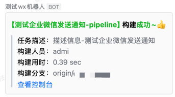
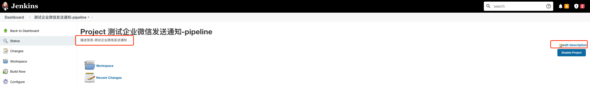

# 企业微信Jenkins构建通知插件

源项目地址：https://github.com/jenkinsci/qy-wechat-notification-plugin

在原插件基础上对Build完成消息支持moreInfo、构建人、项目描述信息打印，以满足业务需求

JDK 1.8

## 使用方法

### 默认打印内容

任务描述、构建人员、构建用时

任务描述：如果设置了就会打印

### moreinfo

内容会拼接在默认打印内容下方